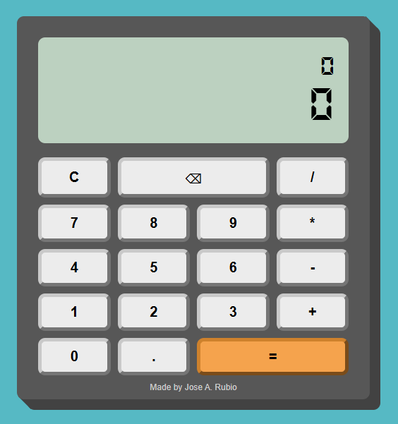

# 🧮 Calculadora en JavaScript

Calculadora desarrollada con **HTML, CSS y JavaScript**.

👉 Proyecto pensado para practicar manipulación del DOM, eventos y buenas prácticas en JavaScript.

---

## 🚀 Demo

🔗 Ver la calculadora en funcionamiento:  
https://Joserubher.github.io/calculator.js/

---

## ✨ Funcionalidades

- Operaciones básicas: suma, resta, multiplicación y división
- Manejo de errores (división por cero)
- Botón de borrar y limpiar
- Interfaz responsive
- Código estructurado con clases (OOP)

---

## 🛠️ Tecnologías utilizadas

- HTML5
- CSS3
- JavaScript (ES6)

---

## 📸 Preview



---

## 📂 Cómo usar el proyecto

1. Clona el repositorio:
   ```bash
   git clone https://github.com/Joserubher/calculatro.js.git
